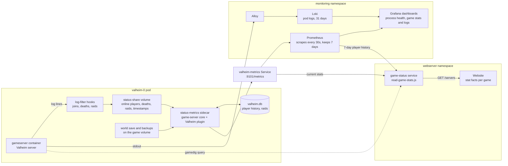

# How Valheim's stats reach Grafana and the website

The game server's log becomes files, the sidecar turns those files into `/metrics`, and two
readers consume that endpoint. Every game works the same way; only its plugin differs
([status-metrics.md](status-metrics.md)).

- **Into the pod's files:** the [log-filter hooks](https://github.com/community-valheim-tools/valheim-server-docker#log-filters)
  in the chart's `lifecycle-hooks.yaml` write the status share; nothing else writes the database.
- **`/metrics`:** built fresh on each request from the files, the save and `valheim.db`
  ([player-database.md](player-database.md)). Metric names follow CLAUDE.md.
- **Grafana:** `game_server_*` and `valheim_*` from Prometheus, plus the server's own log from Loki.
- **Website:** `game-status` reads the sidecar's `/metrics` directly (`GAME_STATS_SOURCES`),
  so its stats don't wait for a scrape; each stat becomes one `StatFact`, e.g. "Day" / "77".
