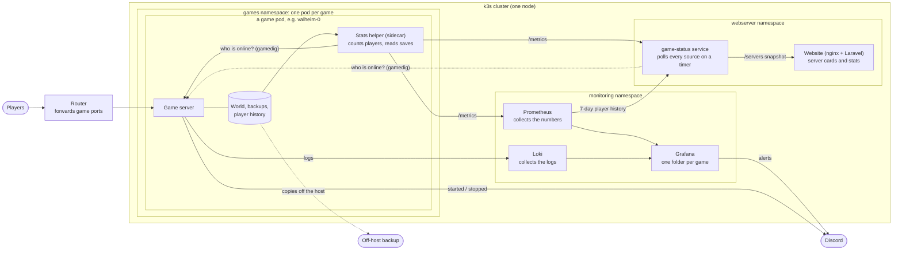

# Overview

How the game servers run and how their stats reach Grafana and the website, in one picture.
Details: [architecture.md](architecture.md), one game's full path: [metrics-flow.md](metrics-flow.md).

- **Game server:** a ready-made image, one per game; the world lives on the pod's volume.
- **Stats helper:** the same core for every game plus a small per-game plugin
  ([status-metrics.md](status-metrics.md)); it serves everything it knows at `/metrics`.
- **Grafana and alerts:** reads Prometheus and Loki; alerts post to Discord
  ([game-monitoring.md](game-monitoring.md)).
- **Website:** a separate game-status service collects everything: each helper's `/metrics`, a gamedig
  query to each server and a week of player history from Prometheus. The site reads only its `/servers` snapshot.
